# Serverless & Container Management Lab

## AWS Lambda API + Dockerized Flask ToDo App

This project demonstrates two practical cloud engineering skills:

1. Building a simple Serverless Greeting API using AWS Lambda and API Gateway.
2. Containerizing a Python Flask ToDo web application using Docker, Docker Hub, and Docker Compose.

---

## Architecture

### 1. Serverless Function

```text
Client request -> API Gateway HTTP API -> AWS Lambda -> JSON response
```

Example response:

```json
{
  "message": "Hello, Ade!"
}
```

### 2. Containerized ToDo App

```text
Browser -> localhost:7000 -> Docker port mapping -> Flask container port 5000 -> mounted todos.json
```

---

## Tech Stack

- AWS Lambda
- Amazon API Gateway
- CloudWatch
- Python
- Flask
- Docker
- Docker Hub
- Docker Compose
- Custom Docker network: skola-net

---

## Project Structure

```text
serverless-container-management/
├── docker-compose.yml
├── README.md
├── screenshots/
├── serverless/
│   └── lambda_function.py
└── todo-app/
    ├── app.py
    ├── Dockerfile
    ├── todos.json
    ├── static/
    └── templates/
```

---

## Serverless Features

The serverless part of this project demonstrates:

- AWS Lambda function written in Python
- API Gateway HTTP endpoint
- JSON response from Lambda
- IAM role and permission configuration
- CloudWatch logs for monitoring and observability

---

## Containerized ToDo App Features

The containerized application demonstrates:

- Python Flask web application
- Dockerfile for building the application image
- Docker image pushed to Docker Hub
- Docker Compose deployment
- Host port 7000 mapped to container port 5000
- File persistence using `todos.json` bind mount
- Custom bridge network named `skola-net`

---

## Docker Hub Image

Docker image:

```text
adert2027/item-todo:latest
```

Pull the image:

```bash
docker pull adert2027/item-todo:latest
```

Run manually with Docker:

```bash
docker run --rm --name todo-test -p 7000:5000 adert2027/item-todo:latest
```

Open in browser:

```text
http://localhost:7000
```

---

## Run the ToDo App with Docker Compose

Start the application:

```bash
docker compose up -d
```

Check running containers:

```bash
docker compose ps
```

Open the application in browser:

```text
http://localhost:7000
```

Stop the application:

```bash
docker compose down
```

---

## Persistence Test

The ToDo application stores data in:

```text
todo-app/todos.json
```

Check data from the host:

```bash
cat todo-app/todos.json
```

Check data from inside the container:

```bash
docker exec -it adert2027-todo-task cat /app/todos.json
```

If both outputs are the same, the bind mount persistence is working correctly.

---

## Screenshots

### Source Project Structure

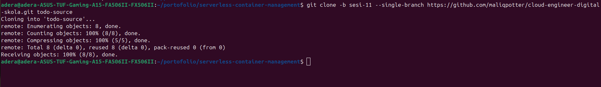

### Lambda Local Test

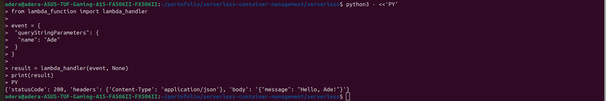

### Lambda Created

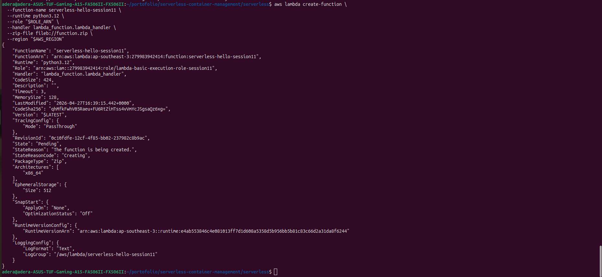

### Lambda AWS CLI Test

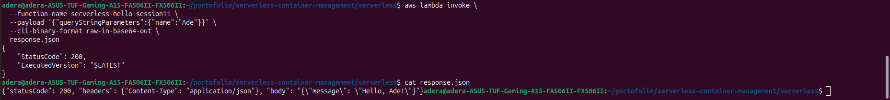

### API Gateway Created

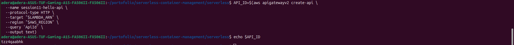

### API Endpoint URL

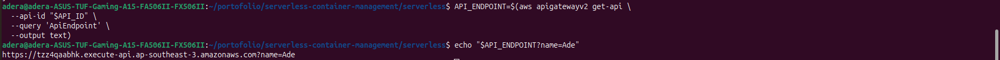

### Serverless Endpoint Running

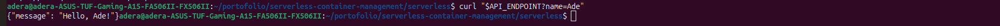

### IAM Role Trust Relationship

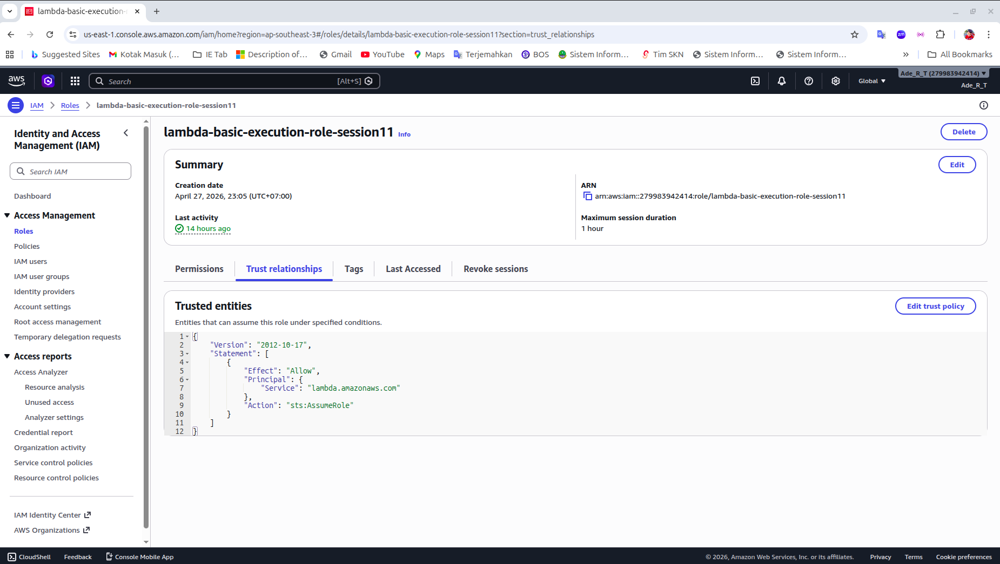

### IAM Role Permission Policy

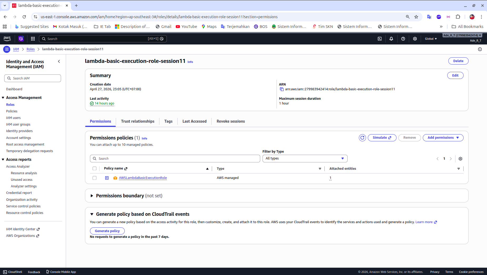

### Lambda Function Overview

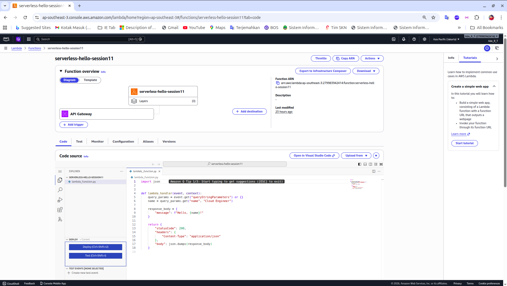

### Lambda Invoke Response

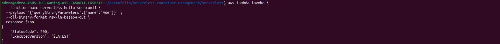

### CloudWatch Lambda Logs

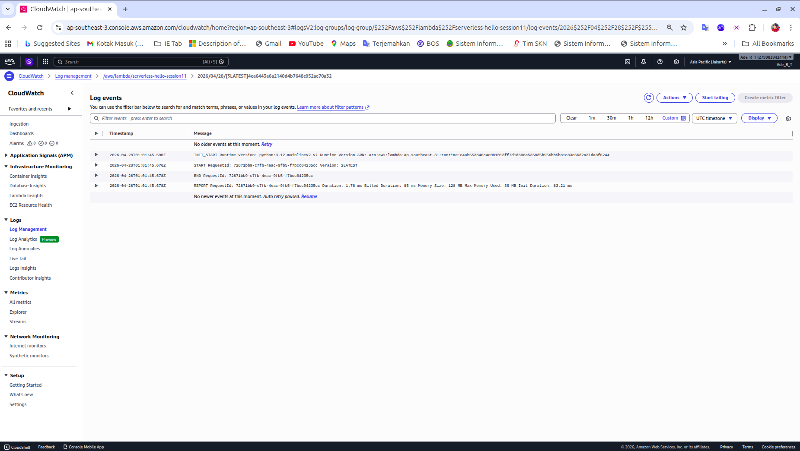

### Docker Image Build

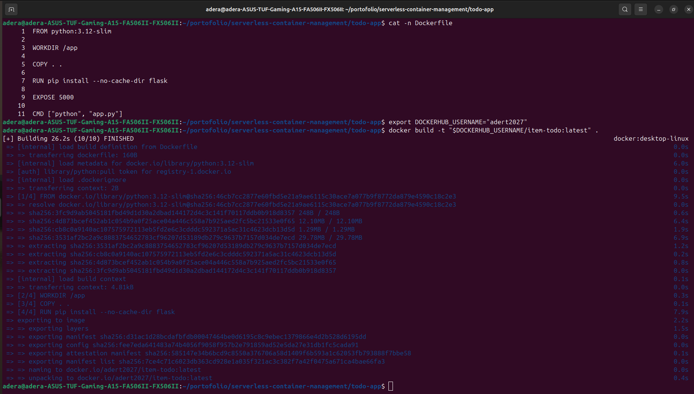

### Manual Container Test

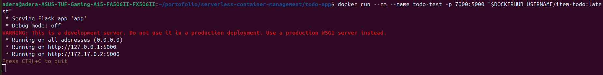

### Localhost Manual Test

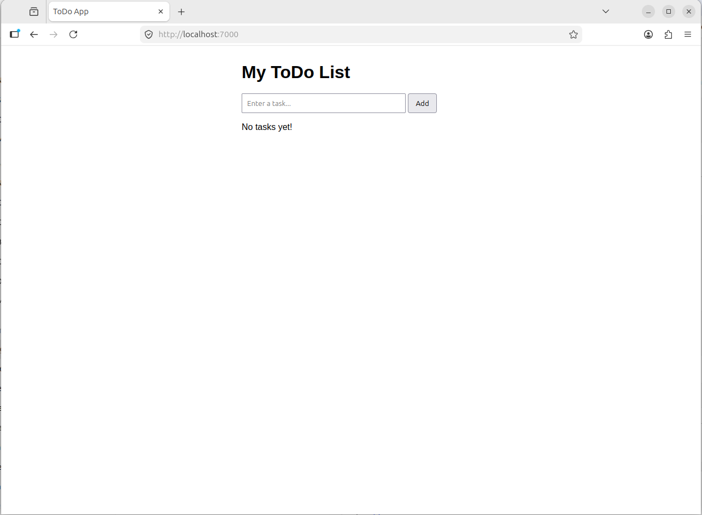

### Localhost Manual Test Result

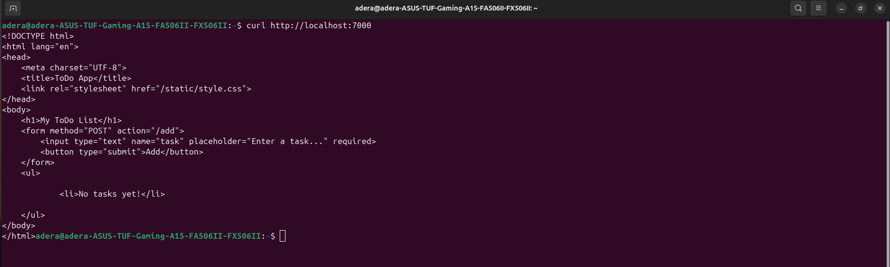

### Docker Push to Docker Hub

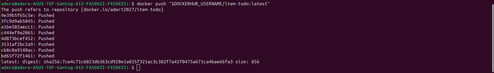

### Docker Compose Up

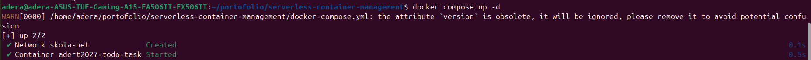

### Docker Container Running

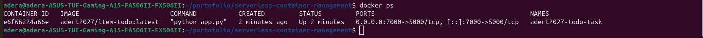

### Docker Network

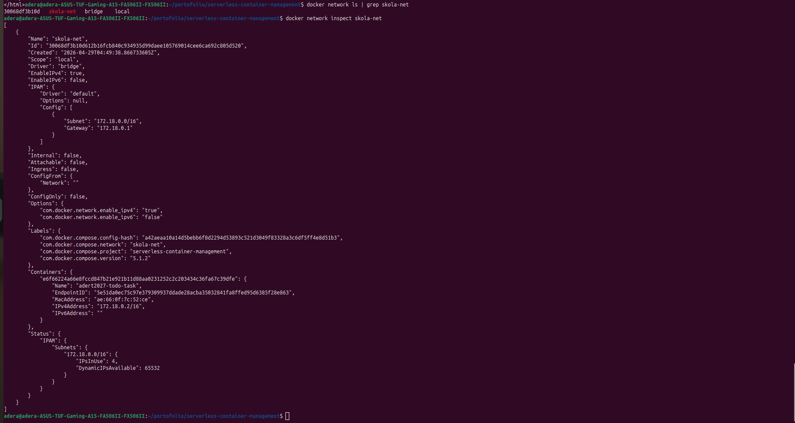

### ToDo App Running on Localhost

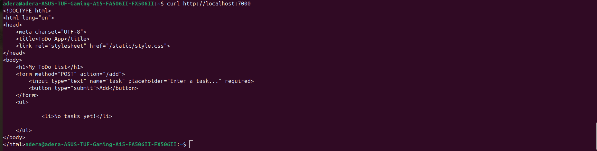

### ToDo JSON Persistence

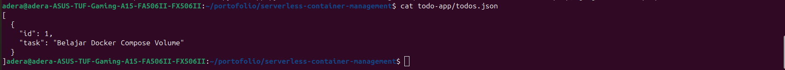

---

## Lessons Learned

Through this project, I practiced:

- Creating and testing serverless functions
- Exposing Lambda through an HTTP API endpoint
- Reading Lambda JSON responses
- Checking CloudWatch logs for observability
- Understanding IAM role permissions for Lambda
- Writing a Dockerfile
- Building and tagging Docker images
- Pushing Docker images to Docker Hub
- Running containers manually using Docker
- Running applications using Docker Compose
- Mapping host ports to container ports
- Using bind mounts for file persistence
- Creating and using a custom Docker bridge network
- Documenting technical work as a professional cloud engineering portfolio

---

## Portfolio Value

This project is designed as a beginner-to-intermediate cloud engineering portfolio project. It combines serverless computing, containerization, networking, persistence, and documentation in one practical lab.
